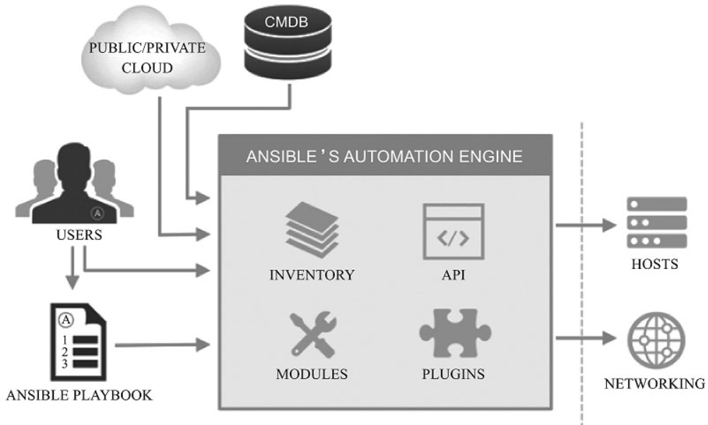
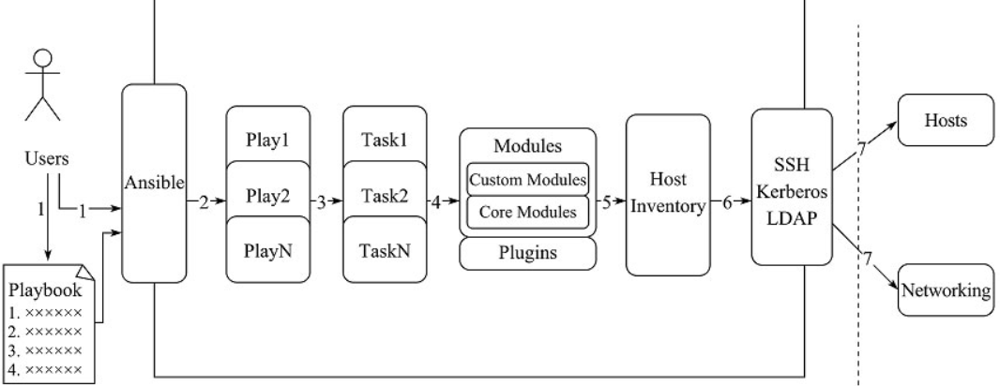

- Ansible 官方地址：https://docs.ansible.com/
- GitHub 地址：https://github.com/ansible/ansible/blob/devel/docsite/rst/index.rst
- Ansible 中文权威地址：http://www.ansible.com.cn/
- Ansible 工作机制：https://www.ansible.com/how-ansible-works

# 1. Ansible 是如何工作的

- ansible 没有客户端，底层通信依赖于系统软件
  - Linux 下基于 openssh 通信
  - windows 下基于 powershell
- 管理端必须是 Linux 系统，使用者认证通过后在管理节点通过 ansible 工具调用各应用模块将指令推送至被管理端执行，并在执行完毕后自动删除产生的临时文件

## 1.1 ansible 的角色

ansible 使用过程中的角色，可以分为：

- 使用者
- ansible 工具集
- 作用对象

  

### 1.1.1 使用者

ansible 的使用者来源于多个维度，例如：

1. CMDB：CMDB 是配置管理数据库，可以用来存储和管理企业 IT 架构中的各项配置信息，运维人员可以通过 CMDB+ansible 下发指令

2. Public/Private：ansible 除了内置 module 外，还提供了 API 接口，如 PHP、python 等多种语言，基于这些公有云/私有云，ansible 可以以 API 调用的方式运行

3. Users：

  1. users 可以直接使用 ad-hoc 临时命令集调用 ansible 工具集来完成任务执行

  2. users 还可以使用预先编写好的 ansible playbooks 来按序执行其中的任务集

### 1.1.2 ansible 工具集

ansible 命令是 ansible 的核心工具，但是 ansible 命令并非通过自身完成所有的功能集，它只是 ansible 执行任务的调用入口

ansible 命令可以调用的内容：

- Inventory：命令执行的目标对象配置文件
- API：供第三方程序调用的应用程序编程接口
- Module：丰富的内置模块
- Plugins：内置和可自定义的插件

### 1.1.3 作用对象

ansible 的作用对象不仅仅是主机，同样可以作用于各类公有/私有云、商业和非商业设备的网络设施

## 1.2 ansible 的工具

如果按 ansible 工具集的组成来分，ansible 则可以看成由六部分组成：

1. ansible playbooks：
   编排定义 ansible 任务集的配置文件，由 ansible 顺序依次执行，默认失败时终止整个 ansible 任务；
   通常是 Json 格式的 yml 文件
2. Inventory：ansible 管理主机的清单
3. Modules：ansible 执行命令的功能模块，多数为内置的核心模块，也可以自定义
4. Plugins：模块功能的补充，如连接类型插件、循环插件变量插件等，该功能不常用
5. API：供第三方程序调用的应用程序编程接口
6. ansible 命令：组合 Inventory、Module、plugin、Api 的命令工具

执行流程：

1. 使用者使用 ansible 或 ansible-playbook 时：在服务器终端输入 ansible 的 Ad-Hoc 命令集或 playbook
2. Ansible 会遵循预先编排的规则将 Playbooks 逐条拆解为 play，再将 play 组织成 ansible 可识别的任务 Task
3. 随后调用任务所涉及的 module 和 plugin
4. 根据 Inventory 中定义的主机列表通过 SSH 将任务集以临时文件或命令的形式传输到远程客户端执行并返回执行结果，如果是临时文件则执行完毕后自动删除

## 1.3 ansible 的通信机制

Ansible 主推的卖点是其无需任何 Daemon 维护进程即可实现相互间的通信，且通信方式是基于业内统一标准的安全可靠的 SSH 安全连接，不过尽管稳定、快速、安全的 SSH 连接是Ansible 通信能力的核心，但 SSH 的连接效率一直被诟病，所以 Ansible 的通信方式和效率在过去的数年中也在不停地改变和提高。

