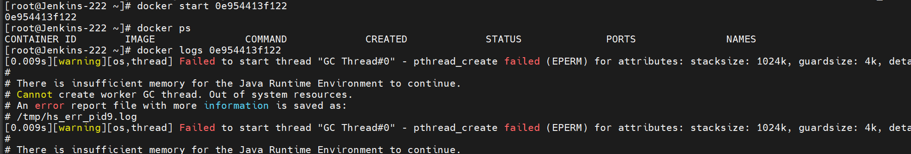

# 1. 现象

1. docker 部署 Jenkins
2. 启动时返回 ID，但是 docker ps 没有正常运行
3. 查看对应日志显示：[0.009s][warning][os,thread] Failed to start thread "GC Thread#0" - pthread_create failed (EPERM) for attributes: stacksize: 1024k, guardsize: 4k, detached

# 2. 解决

## 2.1 提高优先级

第一种方式适用于启动一个新容器时报类似错误，
