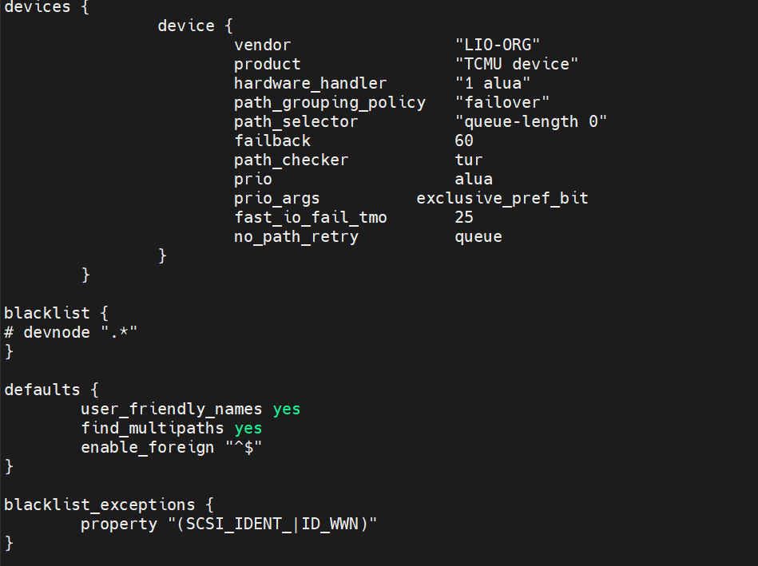

# 1. multipath 简介

# 2. multipath 使用

## 2.1 multipath 的配置文件

```
cat /etc/multipath.conf
```



1. `devices` 部分：这部分定义了对特定设备的处理规则。在这里，配置了对 LIO-ORG 供应商的 "TCMU device" 的处理规则。具体的配置包括：
   1. `vendor` 和 `product`：指定了需要处理的设备的厂商和产品信息。
   2. `hardware_handler`：指定了设备的硬件处理器，这里使用了 ALUA（Asymmetric Logical Unit Access）处理器。

      * ALUA 路径管理模式中的 "1" 表示使用了 ALUA 的标准版本。 ALUA 还有其他版本，比如 "2" 表示使用了 ALUA-2 标准
   3. `path_grouping_policy`：指定了路径分组的策略，这里是 failover，表示在主路径失效时切换到备用路径。
   4. `path_selector`：指定了路径选择器的策略，这里使用了 queue-length 0，表示使用队列长度为 0 的算法进行路径选择。
   5. `failback`：指定了路径的故障恢复时间，这里是 60 秒。
      在生产环境中如果使用主动/被动的分组策略，最好将 failback 设为 immediate，这样在发生路径故障后会立即切换到其他正常路径，以保证正常的数据访问
      failback 一般有以下可选参数：

      * immediate：表示指定立即恢复到包含活跃路径的最高级别路径组群
      * manual：不需要立即恢复，只有在操作者干预的情况下发生恢复
      * followover：当路径组的第一个路径成为活跃路径时应执行自动恢复
      * 大于 0 的数字：指定对应时间的推迟出错切换，以秒为单位，例如本文配置中为 60s
   6. `path_checker`：指定了路径检测器的类型，这里使用了 TUR（Test Unit Ready）检测器。
   7. `prio` 和 `prio_args`：指定了路径的优先级和相关参数，这里是 alua 和 exclusive_pref_bit。
   8. `fast_io_fail_tmo`：指定了快速 IO 失败超时时间，这里是 25 秒。
   9. `no_path_retry`：指定了无路径时的重试策略，这里是 queue，表示将 IO 请求放入队列等待路径恢复。
2. `blacklist` 部分：这部分定义了需要屏蔽的设备。在这里，所有设备都是被注释掉的，表示没有设备被屏蔽。
3. `defaults` 部分：这部分定义了默认的多路径设备配置。具体的配置包括：
   1. `user_friendly_names`：指定了是否使用用户友好的设备名，这里是启用了用户友好的设备名。
   2. `find_multipaths`：指定了是否查找多路径设备，这里是启用了查找多路径设备。
   3. `enable_foreign`：指定了哪些设备应该被视为外部设备，这里是没有指定任何外部设备。
4. `blacklist_exceptions` 部分：这部分定义了例外的黑名单规则。在这里，使用了正则表达式来匹配例外的属性，这里匹配了以 "SCSI_IDENT_" 或 "ID_WWN" 开头的属性。
