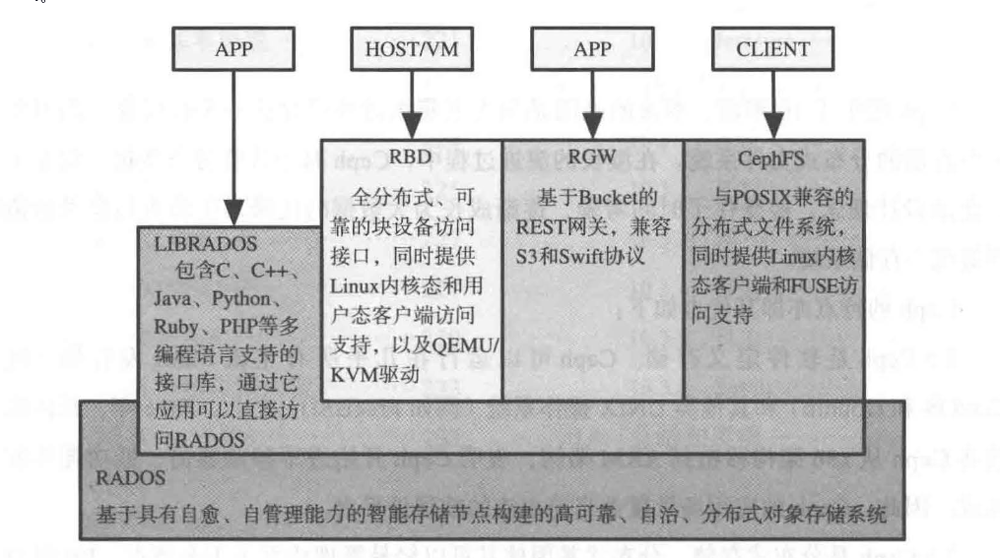
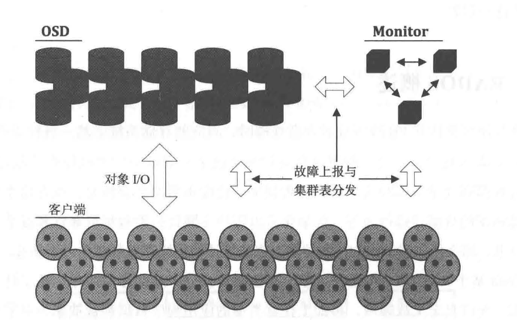
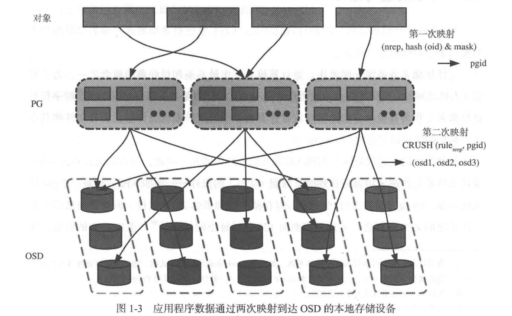

# 一、 RADOS 概述

# 1. ceph 三大核心应用



- 简而言之，一个 rados 集群由大量 OSD 和少数几个 mon 组成
- osd 是个抽象概念，一般对应一个本地块设备（如一块磁盘或者一个 RAID）
  - 在其工作周期内会占用一些 CPU、内存、网络等物理资源
  - 依赖某个具体的本地对象存储引擎，来访问位于块设备上的数据
  - 数据复制、故障检测和数据恢复都由每个 osd 自动进行，因此即便存储容量上升至 PB 级别甚至以上，系统也不会存在明显的调度和处理瓶颈
- mon 团体（quorum），本质上也是一个集群
  - 是基于高可靠设计用来负责维护和分发集群关键元数据的
  - 也是客户端与 RADOS 集群建立连接的桥梁：客户端会通过咨询 mon 集群来获取关键元数据，然后通过约定的方式（也就是 RBD、RGW、CephFS 等）来访问 rados 集群
- 集群表：为了去中心化，避免单点故障
  - RADOS 使用一张紧凑的集群表对集群拓扑结构和数据映射规则进行描述
  - 任何时刻，任何持有该表的合法客户端都可以独立地与位于任意位置的 OSD 直接通信
  - 当集群拓扑发生变化时，RADOS 会使这些变化被 MON 捕获，并通过集群表高效传递至所有受影响的 OSD 和客户端，以保证对外提供不中断的业务访问
- CRUSH 算法：一种基于可扩展哈希的受控副本分布算法，用于连接客户端和 OSD，使得客户端可以直接与 OSD 通信

# 2. 存储池与 PG

设计目的：

实现存储资源按需配置


存储池是什么：

存储池：实际上是个虚拟概念，表示一组约束条件
例如可以针对存储池设计一组 CRUSH 规则，限制其只能使用某些相同规格的 OSD，或者尽可能的将所有数据分布分布在物理上隔离的故障域；
也可以针对不同存储用途的存储池指定不同的副本策略，例如若存储池承载的存储应用对时延敏感，就采用多副本策略，反之，如果存储的是一些对时延不敏感的数据，为提升空间则采用 EC 策略更好


存储池之间的策略隔离是如何实现的：

为了实现不同存储池之间的策略隔离，RADOS 就不能将任何应用程序的数据都一步到位的直接写入 OSD 的本地存储设备，由此引入了一个中间结构，称为 PG，通过执行两次映射来保证策略隔离的同时数据落盘

PGid：

为了维持扁平寻址空间，实际上要求 PG 拥有一个全集群唯一的身份标识 – PGID

由于集群所有 pool 都由 monitor 统一管理，所以 mon 可以为每个 pool 分配一个集群内唯一的 pool 标识；

基于全集群唯一的 pool 标识，只需要为 pool 中的每个 PG 再分配一个 pool 内唯一的编号即可

假设某个 pool 的标识为 1，创建此 pool 时指定了 256 个 PG，那么可以认为对应的 PGID 可以写成 1.1，1.2，…… 1.256 这样的形式

（这里只是为了举例说明，实际采用的显示方式应该是十六进制的）



1. 第一次映射：客户端 –> PG

   - 首先，第一次映射负责将任意类型的客户端数据按照固定大小进行切割、编号
   - 然后将编号作为伪随机哈希函数输入，以此均匀映射至每个 PG，以实现负载均衡

2. 第二次映射：PG –> OSD

   - 仍然采用伪随机哈希函数，以保证 PG 在 OSD 之间分布的均匀性
   - 但是其输入除了全局唯一的 PGid 外，还引入了集群拓扑，并且利用 Crush 规则对映射过程进行调整，以帮助 PG 在不同的 OSD 之间迁移

   依靠 crush 规则对映射过程进行调整，实现了数据可靠性、自动平衡等高级特性

   最终，pool 以 PG 作为基本单位进行管理


# 3. 对象演进与排序

## 3.1 对象标识

- 对象：

  与 Linux 中  “一切皆文件” 的设计类似，ceph 将任意类型的客户端数据都抽象为“对象”

  

- 文件系统中的作用域：

  - 文件系统中，一般使用基于 UTF-8 编码方式的字符串对文件进行命名，作为其唯一身份标识
  - 由于文件命名已经唯一，所以最初的文件系统设计中，所有文件都共享一个扁平的全局命名空间
  - 现代文件系统普遍采用面向管理海量数据（文件）的 tree 设计，例如 XFS、ZFS
    - XFS：64 位文件系统，意味着 XFS 理论上可以存储和管理 2^64 个文件
    - ZFS：面向 128 位寻址空间的设计
  - 树是一种非线性数据结构，树中每个叶子节点代表一个文件，每个中间节点则起到了隔离和保护其辖下所有文件的作用（因此这些中间节点就被称为文件夹/目录）

  

- 对象存储中的作用域：

  - 对象标识：

    ceph 也使用字符串对对象进行标识，使用命名空间对每个对象归属的作用域进行限制和隔离；
    因为对象还必须归属于某个存储池，所以对象还必须记忆其归属的存储池标识

  - 快照和克隆：

    ceph 中的快照和克隆，其实现粒度也是对象级的；

    因此，为了区分原始对象和克隆出来的对象，还需要向对象添加全局唯一的快照标识（snap-id）；

    > 这里的全局唯一并非和存储池标识一样要求全集群唯一，而是取决于快照的粒度，例如快照是基于存储池级别的，那么快照标识也只需要做到存储池内唯一，当然也可以有更小粒度的快照，例如卷（image）快照

    再加上 ceph 又实现了 EC 这种数据备份机制，所以为了满足在对象粒度上的数据回滚时仍然保持数据一致性，就需要某个纠删码对象还要和它对应的所有衍生版本对象进行区分，这个要求是通过向对象种添加分片标识（shard-id）和对象版本号（generation）加以解决

    > 当前 ceph 的纠删码实现中，会以 PG 为粒度，定时对所有过时的对象备份副本进行清理

  综上，ceph 可以基于对象名、命名空间、对象归属的存储池标识、快照标识、分片标识和版本号得到区分集群中各种对象的方法，基于这些特征值构造的数据结构也就被称为对象标识，其在集群内唯一标识一个 ceph 对象


## 3.2 严格排序

ceph 的自动数据恢复与平衡、守护数据正确性与一致性的 Scrub 机制其实都需要依赖于“可以通过某种手段不重复地遍历 PG 中所有对象”这个特性

而能够不重复的遍历，其实就是要求了 PG 中的每个对象都可以进行严格排序

1. 最简单的方法，当然就是先将对象标识中的所有特征值按照顺序拼接，然后比对这个包含了对象所有信息的字符串来实现排序
   但问题在于一些应用场景中（例如 rbd），为了保证对象的唯一性，会使用很长的对象名，这就会使得可读性和排序效率都很低

2. 一个改进的方向就是不使用所有特征值都进行拼接的方式，而是像存储池标识那样，让每个对象也直接使用一个唯一的数字标识
   但这种方式在使用时，就需要客户端在创建每个对象时统一向 mon 申请，这样一来效率更低，而且还增加了 mon 的负担

3. 所以继续改进，不由 mon 来生成唯一的数字标识，而是通过哈希算法来得到不同的输出
   采用哈希的问题在于可能出现哈希冲突，而产生哈希冲突的两个大原因：

   - 算法本身：由于厂家的不断改进，其实这个算法本身已经越来越可靠了
   - 输出长度：在保证算法不断的前提下，增加输出长度可以不同程度的降低产生冲突的概率（但实际效果其实还取决于输入样本容量）

   考虑到当前 ceph 的实现，数据的迁移、Scrub 其实都是以 PG 为单位进行的，所以实际上严格排序只需要能够针对单个 PG 中的全部对象进行排序即可：

   ```
   - 以 1TB 的磁盘举例
   	- 假设每个 OSD 承载 100个 PG，每个对象固定大小为 4MB 
   	- 平均每个 PG 存储的对象数量为：1,048,576 MB ➗ 4 MB ➗ 100 约为 2621 个对象
   ```

   

